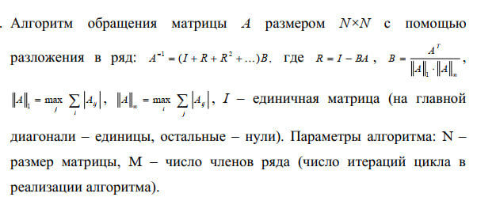

Написано три варианта программы, реализующей алгоритм прикрепленный на фото ниже:
вариант без ручной векторизации,
вариант с ручной векторизацией
вариант с матричными операциями, выполненными с
использованием оптимизированной библиотеки BLAS.
