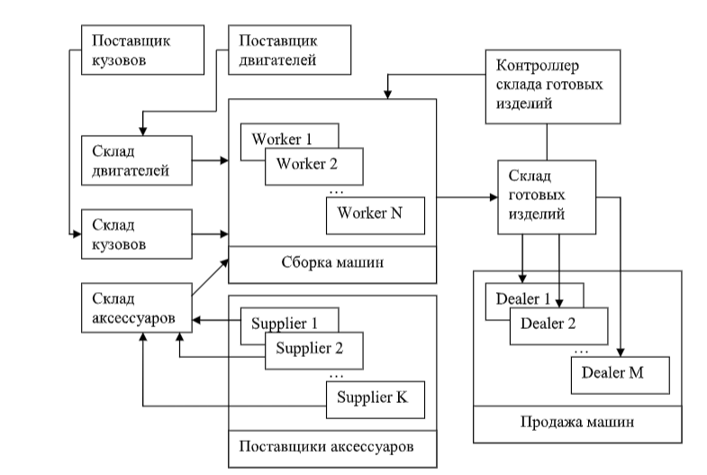

# Постановка задачи: Эмуляция работы фабрики по сборке автомашин

---

## Описание задачи

Написать приложение, эмулирующее работу фабрики по сборке автомобилей.

---

## Состав автомобиля

Автомобиль состоит из трёх частей:
- Кузов
- Двигатель
- Аксессуары

---

## Процесс работы фабрики

- Автомобиль собирается из трёх частей.
- После сборки машина доставляется на склад.
- Со склада автомобиль поступает дилерам.

---

## Дополнительно

Процесс работы фабрики иллюстрируется на схеме:  

---
